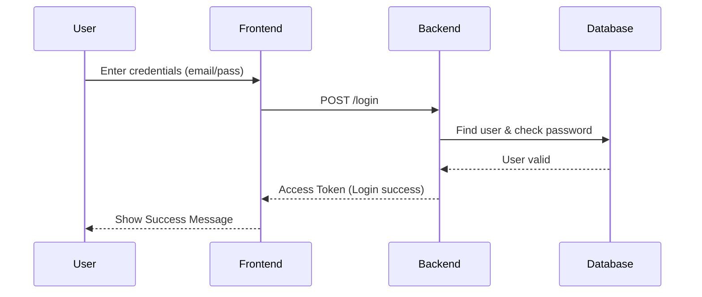
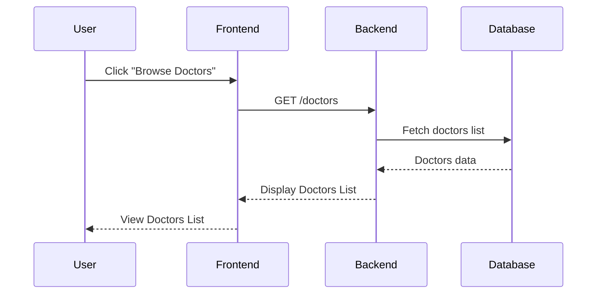
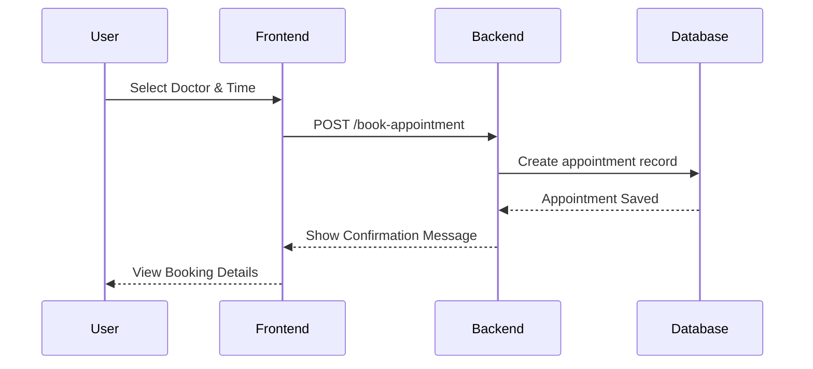

### 1. User Login (US 01)

```mermaid
sequenceDiagram
    participant User
    participant Frontend
    participant Backend
    participant Database

    User->>Frontend: Enter credentials (email/pass)
    Frontend->>Backend: POST /login
    Backend->>Database: Find user & check password
    Database-->>Backend: User valid
    Backend-->>Frontend: Access Token (Login success)
    Frontend-->>User: Show Success Message
```

### 2. Browse Doctors (US 03)

```mermaid
sequenceDiagram
    participant User
    participant Frontend
    participant Backend
    participant Database

    User->>Frontend: Click "Browse Doctors"
    Frontend->>Backend: GET /doctors
    Backend->>Database: Fetch doctors list
    Database-->>Backend: Doctors data
    Backend-->>Frontend: Display Doctors List
    Frontend-->>User: View Doctors List
```

### 3. Book Appointment (US 04)

```mermaid
sequenceDiagram
    participant User
    participant Frontend
    participant Backend
    participant Database

    User->>Frontend: Select Doctor & Time
    Frontend->>Backend: POST /book-appointment
    Backend->>Database: Create appointment record
    Database-->>Backend: Appointment Saved
    Backend-->>Frontend: Show Confirmation Message
    Frontend-->>User: View Booking Details
```
