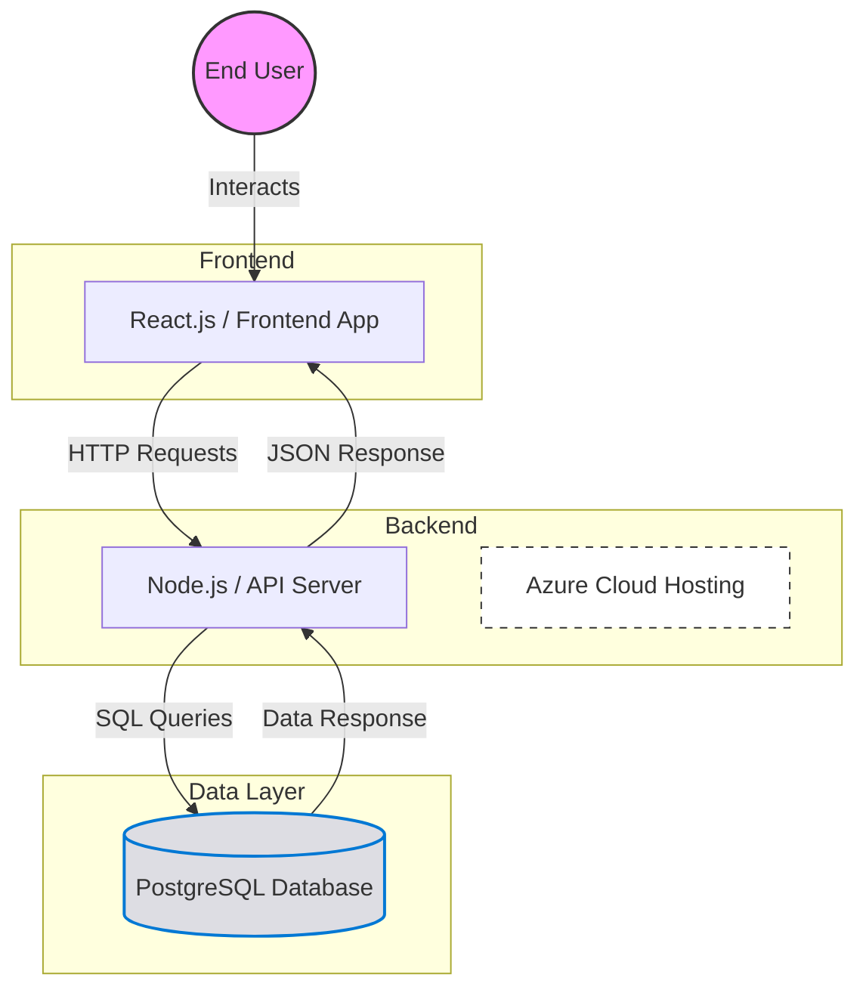

### System Architecture Diagram

```mermaid
graph TD
    %% Define Components
    User((End User))
    
    subgraph Client_Side [Frontend]
        React[React.js / Frontend App]
    end

    subgraph Server_Side [Backend]
        Node[Node.js / API Server]
        Cloud[Azure Cloud Hosting]
    end

    subgraph Storage [Data Layer]
        DB[(PostgreSQL Database)]
    end

    %% Define Connections (Data Flow)
    User -->|Interacts| React
    React -->|HTTP Requests| Node
    Node -->|SQL Queries| DB
    DB -->|Data Response| Node
    Node -->|JSON Response| React
    
    %% Styling
    style User fill:#f9f,stroke:#333,stroke-width:2px
    style DB fill:#00f2,stroke:#0078d4,stroke-width:2px
    style Cloud fill:#fff,stroke:#333,stroke-dasharray: 5 5
```
