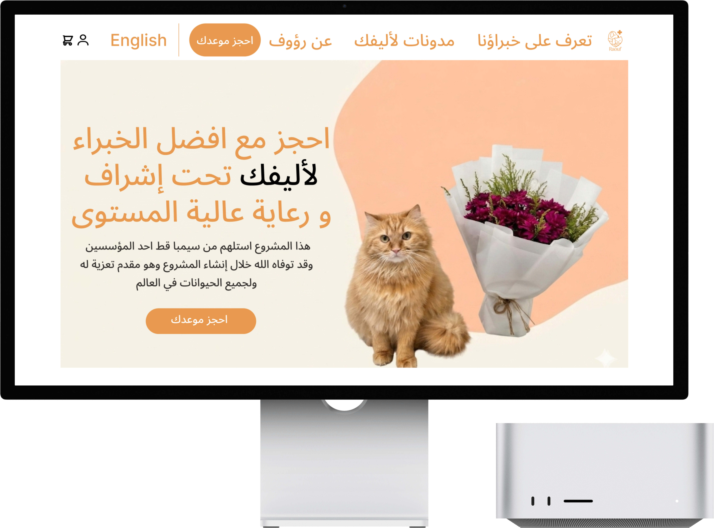

# Rauof - User Stories

## Must Have

### US-01: New Account Registration

**As a** cat owner  
**I want to** create an account on the platform  
**So that I** can book veterinary consultations for my cat

**Acceptance Criteria:**
- Registration via email or mobile number
- Account verification via OTP
- Create basic personal profile

---

### US-02: Add Cat Profile

**As a** cat owner  
**I want to** create a medical profile for my cat  
**So that the** veterinarian has complete information about their health condition

**Acceptance Criteria:**
- Add name, age, breed, weight
- Record medical history and vaccinations
- Save allergies and current medications

---

### US-03: Browse Veterinarians

**As a** cat owner  
**I want to** browse a list of available veterinarians  
**So that I** can choose the most suitable doctor for my cat's condition

**Acceptance Criteria:**
- Display ratings and reviews
- Display price and consultation duration

---

### US-04: Book Instant Consultation

**As a** cat owner  
**I want to** book a remote consultation appointment  
**So that I** can get medical help for my cat without going to the clinic

**Acceptance Criteria:**
- Select doctor and suitable time
- Secure electronic payment

---

### US-05: Conduct Video Consultation

**As a** cat owner  
**I want to** communicate with the doctor via video call  
**So that** they can examine my cat and diagnose their condition remotely

**Acceptance Criteria:**
- Video call functionality
- Ability to send additional photos/videos

---

### US-06: Receive Electronic Prescription

**As a** cat owner  
**I want to** receive a digital prescription after the consultation  
**So that I** can obtain medications for my cat

**Acceptance Criteria:**
- Generate printable PDF prescription
- Medication details, dosage, duration
- Electronic seal and doctor's signature
- Send copy via email

---

### US-07: Appointment Management

**As a** veterinarian  
**I want to** manage my appointment schedule  
**So that I** can organize my time and serve more clients

**Acceptance Criteria:**
- Set available times
- Accept/reject bookings
- View animal details before appointment
- Notifications for upcoming appointments

---

### US-08: Register Profile and Add Cat Information

**As a** cat owner  
**I want to** register my personal information and add my cat's details  
**So that I** can book consultations and appointments in the system

**Acceptance Criteria:**
- Register personal information (name, email, phone number)
- Add cat profile with essential details (name, age, breed, gender)
- Add medical history and health conditions for the cat
- Save and validate all required information before enabling booking features

---

## Should Have

### US-09: Rating and Review System

**As a** cat owner  
**I want to** rate the doctor after the consultation  
**So that I** can help other cat owners choose the right doctor

**Acceptance Criteria:**
- Rating from 1-5 stars
- Optional written review
- Display ratings on doctor's page
- Calculate average rating

---

### US-10: Consultation History

**As a** cat owner  
**I want to** access my previous consultation records  
**So that I** can easily track my cat's medical history

**Acceptance Criteria:**
- Display all previous consultations
- Diagnosis and treatment details
- Previous prescriptions
- Ability to download reports

---

### US-11: Reminder Notifications

**As a** cat owner  
**I want to** receive reminders for vaccination and medication schedules  
**So that I** don't forget routine care for my cat

**Acceptance Criteria:**
- Automatic vaccination schedule based on age
- Reminders for regular medication schedules
- Push/SMS/Email notifications
- Ability to postpone reminder

---

### US-12: Free Follow-up Consultation

**As a** cat owner  
**I want to** request a follow-up consultation within 48 hours  
**So that I** can ensure my cat's condition is improving without additional payment

**Acceptance Criteria:**
- "Free follow-up" option appears within 48 hours
- Short text or voice consultation
- Only once per original consultation

---

## Could Have

### US-13: Loyalty Points System

**As a** cat owner  
**I want to** earn points with each consultation  
**So that I** can get discounts on future consultations

---

### US-14: Veterinary Products Store

**As a** cat owner  
**I want to** purchase medications and cat supplies  
**So that I** save time searching for them in markets

---

### US-15: Cat Owners Community

**As a** cat owner  
**I want to** interact with other cat owners  
**So that I** can exchange experiences and advice

---

## Won't Have

### US-16: Home Delivery Service for Doctor
- Actual home visits

### US-17: Standalone Mobile App
- Will focus on Web App first

### US-18: Integration with Physical Clinics

---

## Mockup for Main Screen

