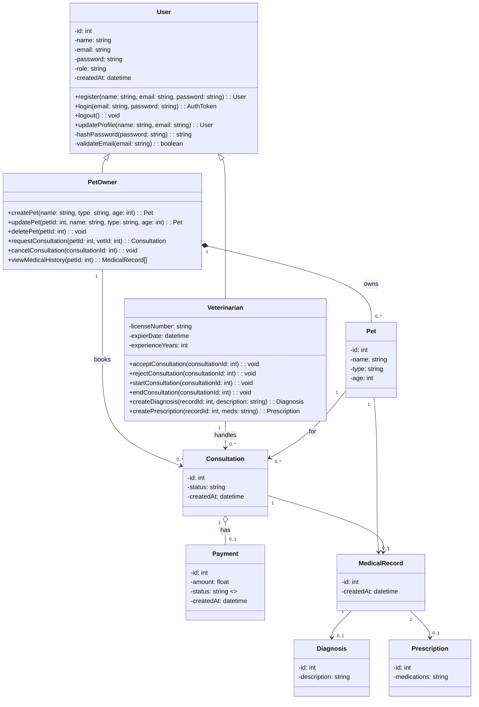
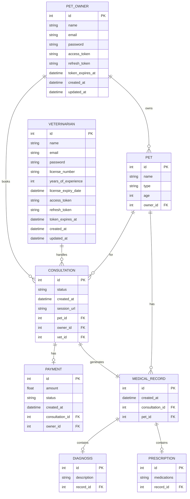

## Class Diagrams

```mermaid

classDiagram

%% ========================
%% USER SYSTEM
%% ========================
class User {
  -id: int
  -name: string
  -email: string
  -password: string
  -role: string
  -createdAt: datetime

  +register(name: string, email: string, password: string): User
  +login(email: string, password: string): AuthToken
  +logout(): void
  +updateProfile(name: string, email: string): User

  -hashPassword(password: string): string
  -validateEmail(email: string): boolean
}

class PetOwner {
  +createPet(name: string, type: string, age: int): Pet
  +updatePet(petId: int, name: string, type: string, age: int): Pet
  +deletePet(petId: int): void

  +requestConsultation(petId: int, vetId: int): Consultation
  +cancelConsultation(consultationId: int): void
  +viewMedicalHistory(petId: int): MedicalRecord[]
}

class Veterinarian {
  -licenseNumber: string
  -expierDate: datetime
  -experienceYears: int


  +acceptConsultation(consultationId: int): void
  +rejectConsultation(consultationId: int): void
  +startConsultation(consultationId: int): void
  +endConsultation(consultationId: int): void

  +createDiagnosis(recordId: int, description: string): Diagnosis
  +createPrescription(recordId: int, meds: string): Prescription
}

User <|-- PetOwner
User <|-- Veterinarian

%% ========================
%% PET SYSTEM
%% ========================
class Pet {
  -id: int
  -name: string
  -type: string
  -age: int
}

PetOwner "1" *-- "0..*" Pet : owns

%% ========================
%% CONSULTATION SYSTEM
%% ========================
class Consultation {
  -id: int
  -status: string
  -createdAt: datetime
}

PetOwner "1" --> "0..*" Consultation : books
Veterinarian "1" --> "0..*" Consultation : handles
Pet "1" --> "0..*" Consultation : for

%% ========================
%% PAYMENT SYSTEM
%% ========================
class Payment {
  -id: int
  -amount: float
  -status: string  <<pending | paid | failed | trial>>
  -createdAt: datetime
}

Consultation "1" o-- "0..1" Payment : has

%% ========================
%% MEDICAL SYSTEM
%% ========================
class MedicalRecord {
  -id: int
  -createdAt: datetime
}

class Diagnosis {
  -id: int
  -description: string
}

class Prescription {
  -id: int
  -medications: string
}

Pet "1" --> "0..*" MedicalRecord
Consultation "1" --> "1" MedicalRecord

MedicalRecord "1" --> "0..1" Diagnosis
MedicalRecord "1" --> "0..1" Prescription


```

## Entity Relationship Diagram (ERD) 

```mermaid
erDiagram

%% ========================
%% PET OWNER
%% ========================
PET_OWNER {
  int id PK
  string name
  string email
  string password
  string access_token
  string refresh_token
  datetime token_expires_at
  datetime created_at
  datetime updated_at
}

%% ========================
%% VETERINARIAN
%% ========================
VETERINARIAN {
  int id PK
  string name
  string email
  string password
  string license_number
  int years_of_experience
  datetime license_expiry_date
  string access_token
  string refresh_token
  datetime token_expires_at
  datetime created_at
  datetime updated_at
}

%% ========================
%% PET
%% ========================
PET {
  int id PK
  string name
  string type
  int age
  int owner_id FK
}

%% ========================
%% CONSULTATION
%% ========================
CONSULTATION {
  int id PK
  string status
  datetime created_at
  string session_url
  int pet_id FK
  int owner_id FK
  int vet_id FK
}

%% ========================
%% PAYMENT
%% ========================
PAYMENT {
  int id PK
  float amount
  string status
  datetime created_at
  int consultation_id FK
  int owner_id FK
}

%% ========================
%% MEDICAL RECORD
%% ========================
MEDICAL_RECORD {
  int id PK
  datetime created_at
  int consultation_id FK
  int pet_id FK
}

%% ========================
%% DIAGNOSIS
%% ========================
DIAGNOSIS {
  int id PK
  string description
  int record_id FK
}

%% ========================
%% PRESCRIPTION
%% ========================
PRESCRIPTION {
  int id PK
  string medications
  int record_id FK
}

%% ========================
%% RELATIONSHIPS
%% ========================

PET_OWNER ||--o{ PET : owns

PET_OWNER ||--o{ CONSULTATION : books
VETERINARIAN ||--o{ CONSULTATION : handles
PET ||--o{ CONSULTATION : for

CONSULTATION ||--o| PAYMENT : has

CONSULTATION ||--|| MEDICAL_RECORD : generates
PET ||--o{ MEDICAL_RECORD : has

MEDICAL_RECORD ||--o| DIAGNOSIS : contains
MEDICAL_RECORD ||--o| PRESCRIPTION : contains
```

