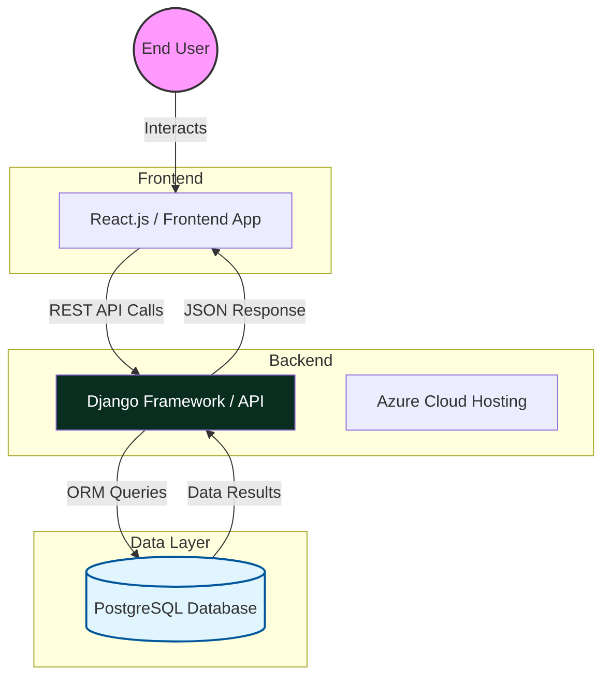
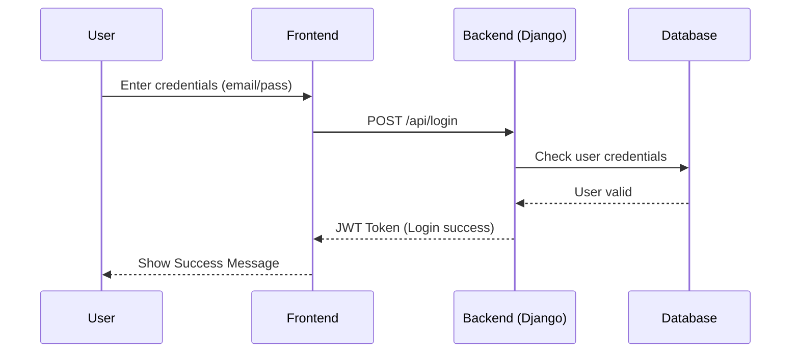
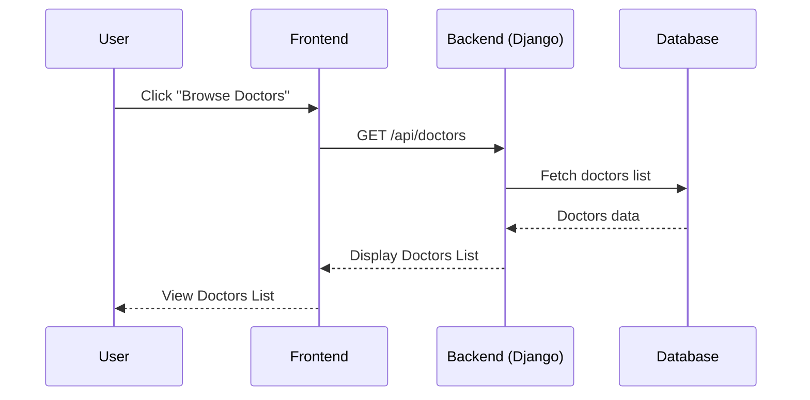
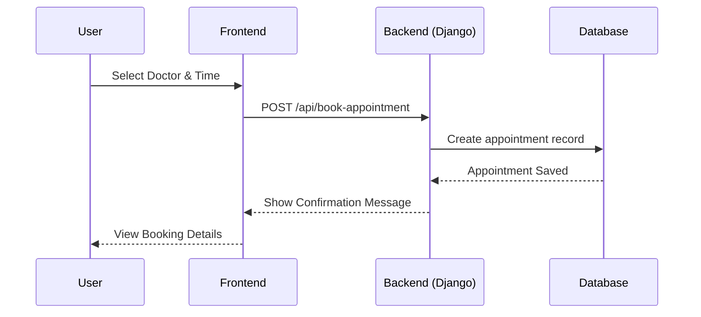

# Project System Design

## 1. System Architecture Diagram
هذا المخطط يوضح بنية النظام وتدفق البيانات بين الواجهة الأمامية، الخلفية (Django)، وقاعدة البيانات.

---

## 2. Sequence Diagrams (Use Cases)
هذه المخططات توضح التتابع الزمني للعمليات الأساسية في النظام.

### A. User Login (US 01)

### B. Browse Doctors (US 03)

### C. Book Appointment (US 04)

