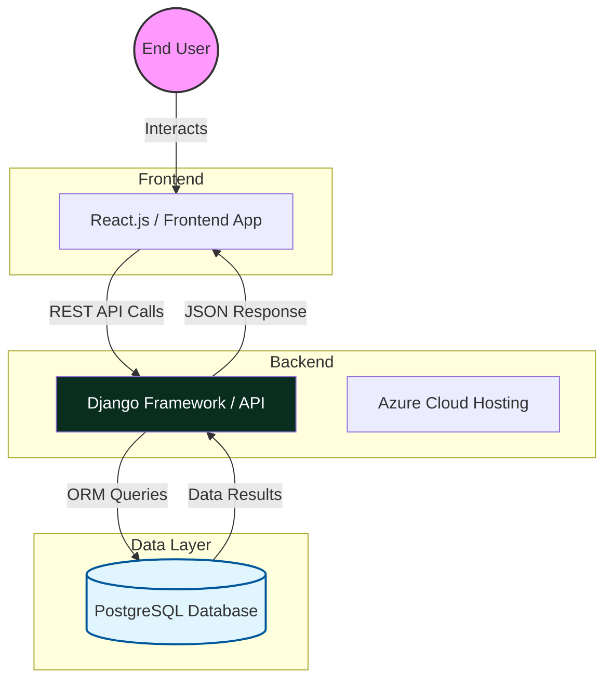

### System Architecture Diagram

```mermaid
graph TD
    %% Define Components
    User((End User))
    
    subgraph Client_Side [Frontend]
        React[React.js / Frontend App]
    end

    subgraph Server_Side [Backend]
        Django[Django Framework / API]
        Cloud[Azure Cloud Hosting]
    end

    subgraph Storage [Data Layer]
        DB[(PostgreSQL Database)]
    end

    %% Define Connections (Data Flow)
    User -->|Interacts| React
    React -->|REST API Calls| Django
    Django -->|ORM Queries| DB
    DB -->|Data Results| Django
    Django -->|JSON Response| React
    
    %% Styling
    style User fill:#f9f,stroke:#333,stroke-width:2px
    style DB fill:#e1f5fe,stroke:#01579b,stroke-width:2px
    style Django fill:#092e20,color:#fff
```
