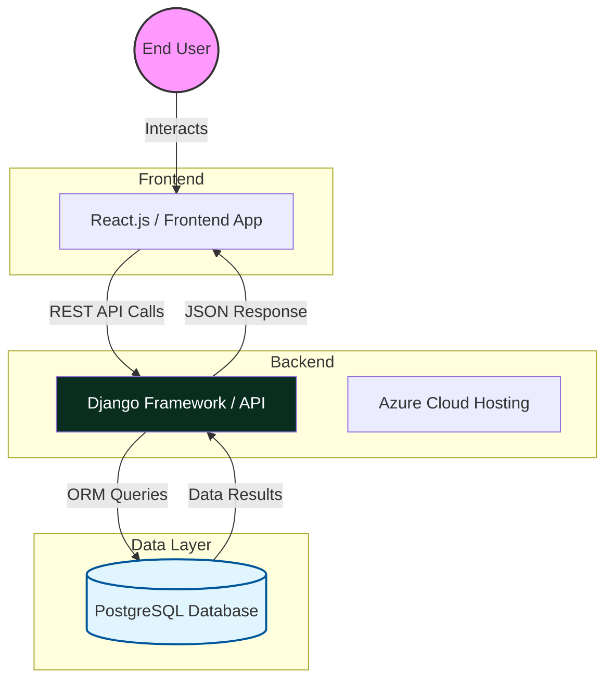
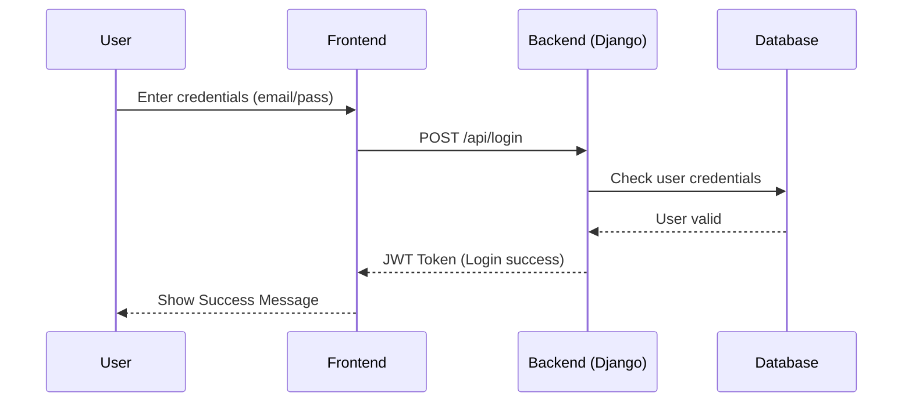
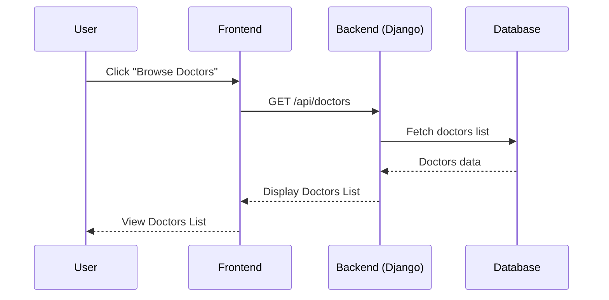
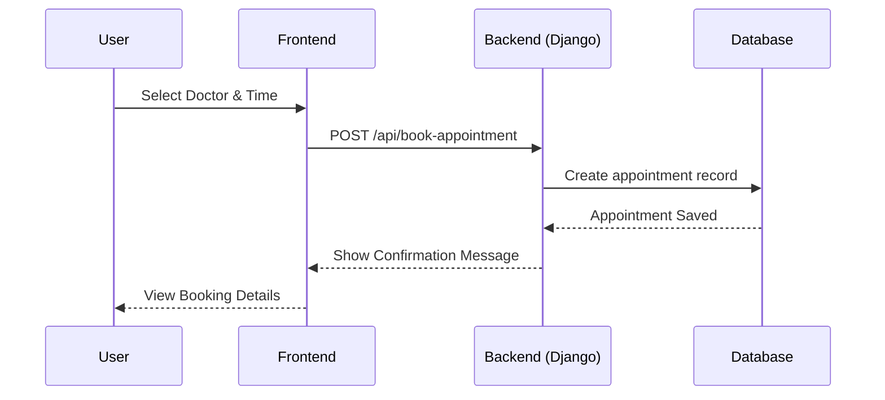

# Technical Design Document

## 1. System Architecture Diagram

```mermaid
graph TD
    %% Define Components
    User((End User))
    
    subgraph Client_Side [Frontend]
        React[React.js / Frontend App]
    end

    subgraph Server_Side [Backend]
        Django[Django Framework / API]
        Cloud[Azure Cloud Hosting]
    end

    subgraph Storage [Data Layer]
        DB[(PostgreSQL Database)]
    end

    %% Define Connections (Data Flow)
    User -->|Interacts| React
    React -->|REST API Calls| Django
    Django -->|ORM Queries| DB
    DB -->|Data Results| Django
    Django -->|JSON Response| React
    
    %% Styling
    style User fill:#f9f,stroke:#333,stroke-width:2px
    style DB fill:#e1f5fe,stroke:#01579b,stroke-width:2px
    style Django fill:#092e20,color:#fff
```

---

## 2. Sequence Diagrams (Critical Use Cases)

### US 01: User Login

```mermaid
sequenceDiagram
    participant User
    participant Frontend
    participant Backend (Django)
    participant Database

    User->>Frontend: Enter credentials (email/pass)
    Frontend->>Backend (Django): POST /api/login
    Backend (Django)->>Database: Check user credentials
    Database-->>Backend (Django): User valid
    Backend (Django)-->>Frontend: JWT Token (Login success)
    Frontend-->>User: Show Success Message
```

### US 03: Browse Doctors

```mermaid
sequenceDiagram
    participant User
    participant Frontend
    participant Backend (Django)
    participant Database

    User->>Frontend: Click "Browse Doctors"
    Frontend->>Backend (Django): GET /api/doctors
    Backend (Django)->>Database: Fetch doctors list
    Database-->>Backend (Django): Doctors data
    Backend (Django)-->>Frontend: Display Doctors List
    Frontend-->>User: View Doctors List
```

### US 04: Book Appointment

```mermaid
sequenceDiagram
    participant User
    participant Frontend
    participant Backend (Django)
    participant Database

    User->>Frontend: Select Doctor & Time
    Frontend->>Backend (Django): POST /api/book-appointment
    Backend (Django)->>Database: Create appointment record
    Database-->>Backend (Django): Appointment Saved
    Backend (Django)-->>Frontend: Show Confirmation Message
    Frontend-->>User: View Booking Details
```
